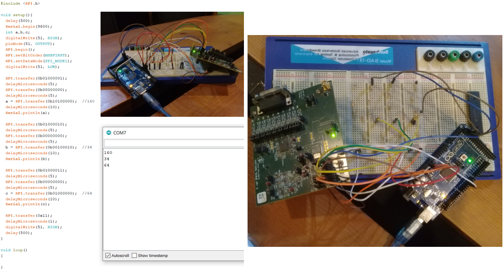

# Register Level SPI Programming for ADS1298

Register-Level SPI Programming for ADS1298 ECG/EEG Front End

This repository contains the work I completed during my internship at Premium International, where I was assigned the task of performing **register-level programming** for the Texas Instruments **ADS1298 ECG/EEG Analog Front End** using an **Arduino Mega** via SPI communication.

The aim was to establish reliable SPI communication between the ADS1298 Evaluation Module (ADS1298RECG-FE) and Arduino Mega, configure the required registers (CONFIG1, CONFIG2, CONFIG3), and verify functionality through the Arduino Serial Monitor.

---

## 🔧 Hardware Used
- **Arduino Mega 2560**
- **ADS1298RECG-FE Evaluation Module (EVM)**
- Custom voltage divider circuits for 5V-to-3.3V level shifting
- Jumper configurations as per EVM manual

---

## 💡 Why Arduino Mega was Used
The ADS1298RECG-FE EVM is typically controlled via the MMB0 Modular EVM Motherboard, but the available MMB0 unit was faulty.
To avoid delays, an Arduino Mega 2560 was used as an alternative SPI master.
This required designing the hardware interface (including voltage dividers) and writing custom register-level SPI code from scratch.

---

## 🔌 Pin Configuration

| Arduino Mega Pin (Master) | ADS1298RECG-FE Pin (Slave) |
|---------------------------|----------------------------|
| 52 (SCK)                  | J3.3 (SCLK)                |
| 51 (MOSI)                 | J3.11 (DIN)                |
| 50 (MISO)                 | J3.13 (DOUT)               |
| 53 (SS)                   | J3.7 (CS)                  |
| 3 (Interrupt)             | J3.15 (DRDY)               |
| 5V                        | J4.10                      |
| 3.3V                      | J4.9                       |
| GND                       | J4.5, J3.4                 |

---

## ⚙️ Tasks Performed
- Studied ADS1298 datasheet & EVM manual
- Implemented SPI communication protocol using Arduino Mega
- Designed and calculated voltage divider resistors for signal level conversion
- Verified power supply voltages at test points
- Programmed WREG commands to configure registers
- Tested and validated output using Arduino Serial Monitor

---

---

## 🛠 Tools & Software Used
- Coding: **Arduino IDE**

---

## 📜 License
This project is shared for educational purposes. Please give credit if you use it.

---

## 📬 Contact
If you have feedback or suggestions, feel free to [open an issue](https://github.com).

---
